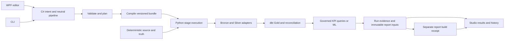

# Product vision and architecture decisions

## The product we are building

Contoso Forge should be a dependable local data and analytics lab: choose a business question, generate reproducible synthetic retail data with known truth and deliberate data-quality cases, execute a clearly scoped pipeline, inspect reconciled KPI or measured ML results, and reopen the same evidence later. The default journey should work without a cloud account. External platforms extend a proven journey when they provide a specific benefit.

The core differentiator is explainable, reproducible evidence across engines and stages. The user should know what ran, which inputs it used, why a KPI matches or an ML metric has limitations, and whether an artifact was merely generated or actually executed. More provider logos and more algorithms are not substitutes for this experience.

Product sequence: dependable local execution and run history → controlled interruption and recovery → guided business configuration and interpretation → one measured external journey → scale and deeper data/ML capabilities. These are priorities derived from the current repository; new user goals can reorder them.

## Current source map and intended ownership

| Layer | Main source | Responsibility |
| --- | --- | --- |
| Deterministic generation | `DatabaseGenerator/Forge/Generation/`, `Specs/`, existing legacy generator | Source rows, repeatability, truth and output contracts |
| Intent and validation | `Forge/Planning/{ProductIntent,JourneyIntent,ScenarioCatalog,WranglingRecipe}.cs`, `Architecture/`, `schemas/` | Valid goals, scenarios, capabilities, typed recipes and supported combinations |
| Planning and compilation | `Forge/Planning/{PlanBuilder,CapabilityResolver}.cs`, `Forge/Pipeline/` | One neutral graph, explicit stage boundaries, engine/runtime mappings; offline plan has no execution side effects |
| Export | `Forge/Export/{FactoryExporter,JourneyExporter}.cs`, versioned `Forge/Templates/` | Generate executable bundles; preserve version-specific compatibility |
| Runtime | Generated `pipeline/run_local.py`, `factory/run.py`; V1.7 `journey_runtime.py`, `layers.py` | Execute compiled stages, bind identities, retain outcomes, verify artifacts |
| Business calculations | Generated `factory/dbt/`, governed model catalogs, reconciliation helpers | Compute canonical Gold and compare measured values to independently generated truth |
| ML | `Templates/v15/ml_lab.py`, version overlays and `v17/external_labs.py` | Feature/label legality, temporal partitions/embargo, validation-based selection, held-out test reporting |
| Results | `v17/journey_report.py`, shared `v15/build_evidence.py` | Immutable upstream report package; separate measured web-build receipt |
| Desktop | `ContosoForge.PipelineStudio/{StudioSession,FactoryStudio,StudioRuntime,JourneyStudio}.cs` | Edit drafts, launch owned processes, show progress and interpret persisted evidence |
| Evidence and release validation | `scripts/test_*.py`, `run_*.py`, `capture_*_evidence.py`, `.github/workflows/` | Reproduce tests, cross-engine comparison, source/run/CI custody and exact revision validation |

Paths under `Forge/` above are relative to `DatabaseGenerator/`. The WPF project is separate from the core solution's test coverage; `dotnet test ContosoDGV2.sln` does not exercise the live WPF runtime flow.

## Decisions that govern development

| ID | Decision | Why / consequence |
| --- | --- | --- |
| ADR-001 | Keep C# contracts/planner/compiler authoritative; no FastAPI rewrite or second UI-owned graph | Prevent competing validation and execution semantics. WPF edits the same contract used by CLI |
| ADR-002 | Keep engine, runtime, storage, table format, warehouse and orchestration choices separate | Capability rejection must name the unsupported combination; engine labels must describe actual execution |
| ADR-003 | dbt owns business calculations; UI/report display stored results and catalog formatting | Avoid divergent KPI formulas and invented ML metrics; selected KPI scope does not yet imply physical pruning |
| ADR-004 | Distinguish planned capability, run outcome, exported-only artifacts, report package and successful web build | A green plan or prior release cannot certify this run; a completed export is not remote execution |
| ADR-005 | Bind results to run ID and immutable input identity; verify artifacts before accepting them | A local history index and in-memory success flag are navigation hints, not authority |
| ADR-006 | Reports use an immutable upstream snapshot; final run and build receipts remain outside that snapshot | Avoid circular hashes and premature success. Keep snapshot scope explicit |
| ADR-007 | Preserve legacy/V1.5/V1.6 contracts and audited artifact bytes | Prefer additive/versioned changes. Do not regenerate expected fixtures to conceal a regression |
| ADR-008 | Local default first; one account-backed provider journey at a time | Lower setup burden and make the execution claim measurable; generated exports retain their limited status |
| ADR-009 | Introduce small testable desktop services for run state, receipt validation and history | Current flags and file paths in the window do not scale to reopening. No general framework migration is needed |
| ADR-010 | S001 reopening is read-only; a new execution gets a fresh identity | Reopening must not silently resume stages, rebuild old evidence, execute imported code, or rewrite receipts |

## S001 target design

**Separate editing, active execution and selected history.** An immutable execution context captures project/graph identity, generated root, state directory, run ID and validated interpreter. An editor revision can differ from a selected historical result; the UI must show that distinction. At most one owned mutating operation runs at once. Opening a report is a separate owned preview lifecycle with consistent guards through startup and shutdown.

**Receipt reader/validator.** A small C# service reads the documented persisted contract without executing generated Python. For a built preview, require the expected run ID, successful build status, report-contract hash, expected artifact location within the selected run, and recorded index hash. Validate the report's immutable source/input hash map as defined by its version. Distinguish malformed, missing, unsupported version and mismatched content from a valid receipt with a failed/export-only outcome. Never invent verification for files the receipt does not cover; current build receipts bind index.html, not every bundled asset. Do not claim signed provenance or resistance to coordinated rewriting of all local evidence.

**Local run catalog.** Use a small versioned JSON index in per-user application data, separate from portable project/graph files. Entries are locators and display hints (run ID, canonical path, recorded time, project label/identity). Load actual outcomes from receipts on selection. Write via temporary sibling and atomic replacement; serialize writes and prevent lost updates across Studio instances, either with a narrow lock/read-merge-write strategy or an explicit single-writer policy. A corrupt/missing index must not alter runs: show recovery guidance and permit explicit folder import. Do not recursively scan entire drives or add a database/service.

**History selection.** Register fresh Studio runs and allow explicitly selecting an existing V1.7 generated root/state. Imported folders are data: never run their scripts. Show missing/moved, failed, export-only, in-progress-at-last-write, unverified and validated outcomes accurately. A persisted `running` field after reopening proves only the last recorded state; without owned live-process evidence it does not mean work is running now. Support locating a moved root where existing identity rules allow it; if relocation invalidates a version's contract, explain that and reject verified preview rather than changing hashes.

**Dependency behavior.** Preflight and runtime must agree on imports/distribution metadata required by the selected V1.7 path. Optional, unused library metadata cannot turn a completed Bronze stage into failure. Missing required runtime dependencies must fail before source generation in Studio. Use one small declarative dependency description where practical; add a cross-layer consistency test if constraints require two representations. Do not silently install libraries. Preserve historical templates through V1.7 overlays as needed.

Lead clarification after S001 review: required packages are the union of the **included operations' actual runtimes**, not just the Silver-engine choice. Local Spark ML can coexist with DuckDB Silver; a Spark-ML Colab export and a stop before analysis have different local requirements. Test those independent choices together.

For history selection, construct and validate a candidate locator before committing selection state. Expected malformed-evidence/path errors must be handled by the UI boundary as diagnostics, preserving a usable state and original bytes. Service tests that expect an exception are insufficient proof that the desktop handles that exception safely.

## Later architectural work, not S001 implementation

- Owned cancellation must cover C# generation, Python children, report-build subprocesses and honest interrupted evidence. Resume needs an explicit compatibility/retry contract; cancellation is not automatically safe retry.
- Guided forms must round-trip unknown/advanced contract fields, validate drafts atomically, and reuse governed catalogs and C# rules.
- Template overlays currently use text replacements in `JourneyExporter`. Guard assumptions before expanding them; plan a compatibility-preserving refactor separately if needed.
- Physical pruning requires a real dependency closure across source truth, SCD2/quality cases, Silver, dbt and ML, with parity against the full materialization path.
- Broader wrangling needs explicit type/null/join/tie semantics across engines. Large data requires measured memory/time behavior; current bounded fixtures do not establish production scale.
- New regression targets and portable model exports require leakage/serialization reviews. Persistent Airflow and retry certification need real execution evidence, not generated DAGs alone.
